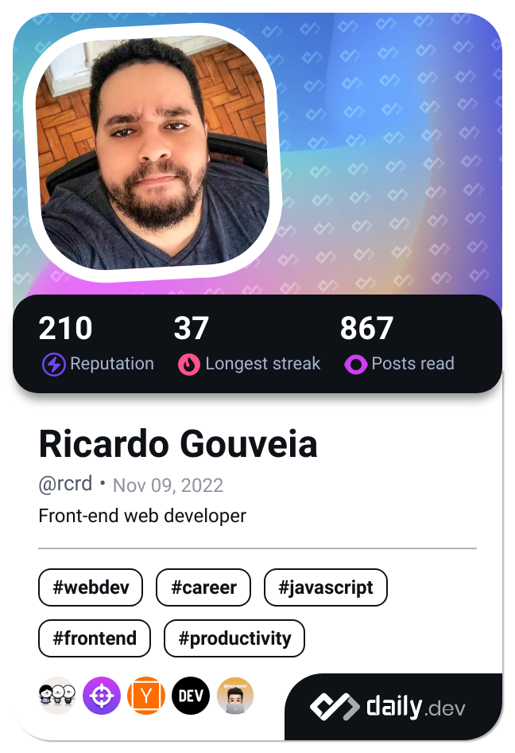

## Hi there 👋

I'm Ricardo Gouveia (he/him), a front-end developer and UI designer from Brazil 🇧🇷. I specialize in front-end frameworks like React and Angular, mobile apps development with React Native, and interaction design for mobile and web.

I'm actively working towards becoming a technical anchor and community manager, specializing in front-end development. I contribute to the developer community by writing articles on platforms like dev.to, while also taking on leadership roles as the organizer of the HTML-SP meetup group and a speaker at local meetups.

---

### 📫 Getting in touch

I love discussing tech, the developer community, diversity, memes, and more!

- 🔗 Check out my personal website [rcrd.dev](https://rcrd.dev) for my portfolio, development experiences (labs), and articles. You'll find all my social networks linked there too! For professional inquiries, feel free to use the contact form.
- 🗒 Find my writings on [Dev.to](https://dev.to/ricardogouveia3)
- 📽 Watch my past Meetup talks on [Speakerdeck](https://speakerdeck.com/ricardogouveia3)
- 🦋 Reach out to me on [BlueSky](https://bsky.app/profile/rcrd.dev). You can send me a DM there, but fair warning, it's mostly memes...
- 💬 Connect with me on [Telegram](https://t.me/ricardogouveia3)
- 📧 Send me an [email](mailto:me@rcrd.dev)
- *️⃣ All other links can be found in my [link aggregator](https://links.rcrd.dev/).

---

### ⚡ Fun facts

- 🗣 I was born in the northeast of Brazil, raised in the north, and now live in the southeast. My Portuguese accent is a unique mix of all those places—I can't even define it myself!
- 📸 I enjoy photography, and you can check out some of my clicks on [Unsplash](https://unsplash.com/@rcrd_landscape)
- 🛩 I used to be afraid of flying, but now I'm an aviation nerd and know more about airplanes than I probably should...
- 🕹 I'm a PC gamer, but I also have a deep love for old video games. I own original SNES, N64, and GameBoy Advance SP consoles.

---

### 📖 Latest posts
<!-- DEVTOPOSTS:START -->
- [Comunidade como indicativo de empresas](https://dev.to/rcrd/comunidade-como-indicativo-de-empresas-2jmd)
- [O front-end além da web](https://dev.to/rcrd/o-front-end-alem-da-web-1li3)
- [Ninguém pode te dizer quanto tempo leva para se tornar &quot;dev&quot;](https://dev.to/rcrd/ninguem-pode-dizer-quanto-tempo-leva-para-virar-dev-16n6)
- [Minha Stack Pessoal - Parte 1: Introdução](https://dev.to/ricardogouveia3/minha-stack-pessoal-parte-1-introducao-27fn)
- [Adeus Medium. Olá DEV Community](https://dev.to/rcrd/adeus-medium-ola-dev-community-4n4p)
<!-- DEVTOPOSTS:END -->

---

### 🔄️ Dev Card

